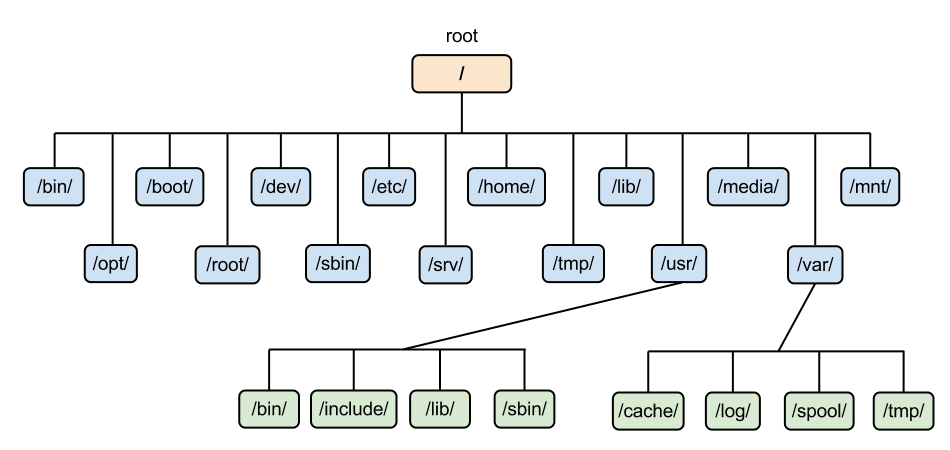
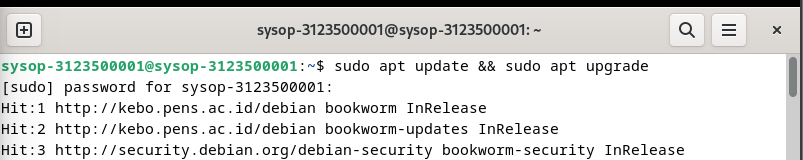
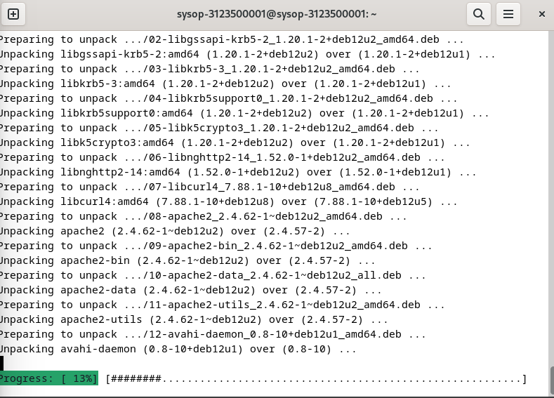
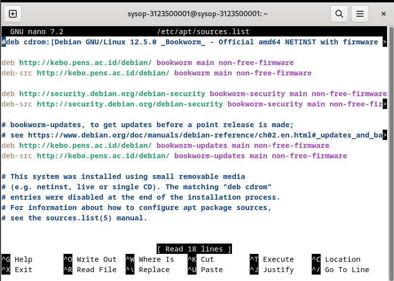

<div align="center">
  <h1 style="text-align: center;font-weight: bold">TUGAS 2<br>Workshop Administrasi Jaringan</h1>
  <h4 style="text-align: center;">Dosen Pengampu : Dr. Ferry Astika Saputra, S.T., M.Sc.</h4>
</div>
<br />
<div align="center">
  
  <h3 style="text-align: center;">Disusun Oleh : <br></h3>
  <p style="text-align: center;">
    <strong>Muhammad Yafi Rifdah Zayyan
    <p style="text-align: center;">
    <strong>Nrp: 3123500001</strong></p>
  </p>

<h3 style="text-align: center;line-height: 1.5">Politeknik Elektronika Negeri Surabaya<br>Departemen Teknik Informatika Dan Komputer<br>Program Studi Teknik Informatika<br>2023/2024</h3>
  <hr><hr>
</div>

# Kontrol Proses di Unix dan Linux
---

# 📖 Chapter 4
---

### Pengertian Proses

Proses terdiri dari ruang alamat (address space) dan sekumpulan struktur data dalam kernel. Ruang alamat adalah sekumpulan halaman memori yang ditandai oleh kernel untuk digunakan proses. Halaman memori biasanya berukuran 4KiB atau 8KiB, digunakan untuk menyimpan kode, data, dan stack proses.

Proses dapat dianggap sebagai wadah untuk sekumpulan sumber daya yang dikelola oleh kernel untuk menjalankan program. Sumber daya ini meliputi:

Halaman memori untuk kode dan data program

File descriptor untuk file yang terbuka

Atribut lain yang menggambarkan status proses
Kontrol proses dalam sistem operasi Unix dan Linux mencakup kemampuan untuk memantau dan mengelola proses, termasuk menjalankan, menghentikan, memantau, dan menetapkan prioritas proses. Proses adalah instance dari sebuah program yang berjalan, dan setiap proses memiliki ID unik yang disebut **PID (Process ID)**. Manajemen proses sangat penting bagi administrator sistem untuk menjaga stabilitas, efisiensi, dan keamanan sistem.

---

## 📋 1. Memantau Proses

### ***Pemantauan Proses Dasar***
Komponen dari Proses

Sebuah proses terdiri dari ruang alamat (address space) dan sekumpulan struktur data dalam kernel. Ruang alamat adalah sekumpulan halaman memori (memory pages) yang digunakan untuk kode, data, dan stack dari proses tersebut.

Struktur Data Proses

- Peta ruang alamat proses

- Status proses (berjalan, tidur, dll.)

- Prioritas proses

- Sumber daya yang digunakan (CPU, memori, dll.)

- File dan port jaringan yang dibuka

- Signal mask (sinyal yang diblokir)

- Pemilik proses (ID pengguna)

- Konteks eksekusi CPU

- Informasi penggunaan memori dan statistik kinerja

---

## PID dan PPID
- 🆔 PID (Process ID)**: ID unik untuk setiap proses.
- 🆔 PPID (Parent Process ID)**: ID proses induk yang membuat proses tersebut.

## UID dan EUID
- **🆔 UID (User ID)**: ID pengguna asli proses.
- **🆔 EUID (Effective User ID)**: ID untuk menentukan hak akses.

---
## 📡 Sinyal (Signals)

Sinyal digunakan untuk komunikasi antar proses dan notifikasi dari kernel. Beberapa sinyal penting:

SIGKILL (KILL): Menghentikan proses tanpa bisa dicegah.

SIGINT (INT): Menghentikan proses dengan .

SIGTERM (TERM): Meminta proses untuk menghentikan eksekusi secara bersih.

SIGHUP (Hangup): Menginformasikan bahwa terminal telah ditutup.

### Kill 

---
## Monitoring Prosess Menggunakan Perintah `Ps`
Perintah ps adalah alat utama bagi administrator sistem untuk memantau proses. Meskipun setiap versi ps mungkin memiliki argumen dan tampilan yang berbeda, semuanya memberikan informasi yang pada dasarnya sama.

### Informasi yang Diberikan

ps dapat menampilkan informasi berikut tentang proses:

- PID (Process ID): ID unik proses.

- UID (User ID): ID pengguna yang menjalankan proses.

- Prioritas proses.

- Terminal kontrol (Control terminal) proses.

- Penggunaan memori oleh proses.

- Waktu CPU yang telah dikonsumsi.

Status proses, seperti berjalan (running), berhenti (stopped), tidur (sleeping), dan sebagainya.

---
## 📄 Perintah Dasar
```bash
$ ps aux | head -8
```

Perintah di atas menampilkan delapan baris pertama dari output perintah `ps aux`, yang berguna untuk memantau proses dalam sistem Unix/Linux.

## 🧾 Penjelasan Kolom Output
| Kolom | Deskripsi |
|-------|------------|
| `USER` | Pemilik proses. |
| `PID` | ID unik untuk setiap proses (*Process ID*). |
| `%CPU` | Persentase penggunaan CPU oleh proses. |
| `%MEM` | Persentase penggunaan memori fisik oleh proses. |
| `VSZ` | Ukuran memori virtual (dalam KB) yang digunakan proses. |
| `RSS` | *Resident Set Size*, memori fisik (dalam KB) yang digunakan proses. |
| `TTY` | Terminal kontrol proses (jika ada). |
| `STAT` | Status proses (*S*, *I<*, *Ss*, dll.). |
| `START` | Waktu atau tanggal proses dimulai. |
| `TIME` | Total waktu CPU yang telah digunakan proses. |
| `COMMAND` | Nama perintah atau jalur eksekusi proses. |

## 🔍 Contoh Output
```bash
USER       PID %CPU %MEM    VSZ   RSS TTY      STAT START   TIME COMMAND
root         1  0.0  0.0  22556  2584 ?        Ss   2019   0:02 /sbin/init
root         2  0.0  0.0      0     0 ?        S    2019   0:00 [kthreadd]
root         3  0.0  0.0      0     0 ?        I<   2019   0:00 [rcu_gp]
root         4  0.0  0.0      0     0 ?        I<   2019   0:00 [rcu_par_gp]
root         6  0.0  0.0      0     0 ?        I<   2019   0:00 [kworker/0:0H-kblockd]
root         8  0.0  0.0      0     0 ?        I<   2019   0:00 [mm_percpu_wq]
root         9  0.0  0.0      0     0 ?        S    2019   0:00 [ksoftirqd/0]
```

## 🔑 Interpretasi
- Proses dengan PID `1` (`/sbin/init`) adalah proses pertama yang dijalankan saat booting.
- Proses kernel (`[kthreadd]`, `[rcu_gp]`, dll.) biasanya tidak menggunakan banyak sumber daya.

### Menggunakan `Ps`
- `ps`: Menampilkan snapshot proses yang sedang berjalan.
  ```bash
  ps aux
  ```
  Opsi `a` menampilkan proses dari semua pengguna, `u` memberikan output dalam format yang lebih mudah dibaca, dan `x` menunjukkan proses tanpa terminal.

### Menggunkaan `top` dan `htop`
- `top` / `htop`: Penampil proses dinamis secara real-time.
  ```bash
  top
  htop
  ```
  Menampilkan proses yang menggunakan banyak sumber daya sistem, dengan kemampuan untuk mengurutkan dan memfilter data.

- `pgrep <nama_proses>`: Mencari ID proses berdasarkan nama proses.

- `pidof <nama_proses>`: Mengembalikan PID dari proses tertentu.
---

### 🛠️ **Tools Pemantauan Lanjutan**
- `vmstat`: Menampilkan statistik kinerja sistem (memori, swap, I/O).
  ```bash
  vmstat 5
  ```
  Angka 5 menunjukkan interval dalam detik untuk memperbarui data.

- `iostat`: Memantau aktivitas perangkat I/O.
  ```bash
  iostat -x 5
  ```
  Opsi `-x` menampilkan informasi yang lebih detail.

- `mpstat`: Menampilkan statistik CPU per prosesor.
  ```bash
  mpstat -P ALL 5
  ```

- `pidstat`: Menampilkan statistik untuk proses tertentu.
  ```bash
  pidstat -p <PID>
  ```

- `watch <command>`: Menjalankan perintah secara berkala untuk memantau perubahan status sistem.
  ```bash
  watch -n 2 df -h
  ```
  Menjalankan perintah `df -h` setiap 2 detik untuk memantau ruang disk.

---

## ▶️ 2. Menjalankan dan Menghentikan Proses

### ✅ **Menjalankan Proses**
- Menjalankan proses secara normal:
  ```bash
  command
  ```

- Menjalankan proses di latar belakang:
  ```bash
  command &
  ```
  Tanda `&` menjalankan proses tanpa mengunci terminal.

- Mencegah proses berhenti saat terminal ditutup:
  ```bash
  nohup command &
  ```
  `nohup` (no hangup) membuat proses tetap berjalan meskipun sesi terminal ditutup.

- Menjalankan proses di latar belakang dengan output ke log file:
  ```bash
  nohup command > output.log 2>&1 &
  ```
  Mengalihkan output standar dan error ke file `output.log`.

### ❌ **Menghentikan Proses**
- Menghentikan proses berdasarkan PID:
  ```bash
  kill <PID>
  ```

- Menghentikan semua proses berdasarkan nama:
  ```bash
  killall <nama_proses>
  ```

- Menghentikan proses secara paksa:
  ```bash
  pkill -9 <nama_proses>
  ```
  `-9` mengirim sinyal `SIGKILL` untuk memaksa proses berhenti.

- Menghentikan proses menggunakan sinyal tertentu:
  ```bash
  kill -SIGTERM <PID>
  ```
  Sinyal `SIGTERM` memberi kesempatan proses untuk membersihkan sebelum berhenti.

---

## 🔄 3. Mengelola Proses Latar Belakang dan Foreground

### 🎯 **Perintah Manajemen Proses**
- `bg <job_id>`: Melanjutkan proses yang dihentikan di latar belakang.
- `fg <job_id>`: Membawa proses kembali ke foreground.
- `jobs`: Menampilkan daftar proses yang berjalan di latar belakang dalam sesi terminal.

### 📌 **Contoh**
```bash
sleep 100 &    # Menjalankan perintah sleep di latar belakang
jobs            # Memeriksa proses latar belakang yang berjalan
fg %1           # Membawa job 1 ke foreground
```

---

## ⚖️ 4. Mengatur Prioritas Proses

### 🆕 **Menjalankan Proses dengan Prioritas Tertentu**
- `nice -n <prioritas> <command>`: Menjalankan perintah dengan prioritas tertentu (-20 hingga 19, semakin rendah semakin tinggi prioritasnya).
```bash
nice -n 10 my_script.sh
```

### 🔄 **Mengubah Prioritas Proses yang Berjalan**
- `renice <prioritas> -p <PID>`: Menyesuaikan prioritas proses yang sudah berjalan.
```bash
renice -5 -p 1234
```

- Melihat prioritas proses menggunakan `top`:
  - Kolom `NI` (nice value) menunjukkan prioritas proses.

---

## 🛠️ 5. Alat Tambahan untuk Kontrol Proses

- `screen` dan `tmux`: Membuat sesi terminal yang dapat dilepas (detach) dan dilanjutkan kembali.
- `strace`: Melacak panggilan sistem (system calls) yang dilakukan oleh proses.
  ```bash
  strace -p <PID>
  ```

- `lsof`: Menampilkan daftar file yang sedang dibuka oleh proses tertentu.
  ```bash
  lsof -p <PID>
  ```

---

## 🚀 Praktik Terbaik

- Hindari menggunakan `kill -9` kecuali benar-benar diperlukan, karena tidak memberi kesempatan proses untuk membersihkan sumber daya.
- Secara rutin pantau kinerja sistem menggunakan alat seperti `top`, `htop`, dan `vmstat`.
- Berikan prioritas pada proses kritis menggunakan perintah `nice` dan `renice`.
- Gunakan `screen` atau `tmux` saat menjalankan proses jangka panjang di server jarak jauh.

---

## 📝 Kesimpulan
Kontrol proses sangat penting untuk menjaga sistem Unix/Linux tetap sehat dan efisien. Menguasai perintah dan alat ini dapat membantu administrator sistem mengelola proses dengan efektif, meningkatkan stabilitas sistem, dan mengoptimalkan penggunaan sumber daya.

Manajemen proses yang baik dapat mencegah sistem dari kelebihan beban, membantu dalam pemecahan masalah, dan memastikan bahwa layanan penting selalu berjalan dengan prioritas yang tepat. Teruslah berlatih dan bereksperimen dengan berbagai skenario untuk meningkatkan keterampilan

---

# Chapter 5 File System
 

## Pengantar

Sistem berkas memiliki tujuan utama untuk merepresentasikan dan mengorganisir sumber daya penyimpanan dalam sistem. Secara umum, sistem berkas terdiri dari empat komponen utama:

1. **Namespace**: Cara untuk menamai dan mengorganisir objek dalam hierarki.
2. **API (Application Programming Interface)**: Kumpulan sistem panggilan untuk menavigasi dan memanipulasi objek.
3. **Model Keamanan**: Skema untuk melindungi, menyembunyikan, dan berbagi objek.
4. **Implementasi**: Perangkat lunak yang menghubungkan model logis ke perangkat keras.

---
## 📁 Struktur Direktori
Berikut ini adalah struktur direktori utama dalam sistem berkas Unix/Linux dan fungsinya:

- **/**: Direktori akar (root), puncak dari semua direktori.
- **/bin**: Berisi *binary* penting untuk sistem, seperti `ls`, `cp`, `mv`.
- **/boot**: Berisi file boot loader seperti kernel Linux dan file konfigurasi boot.
- **/dev**: Berisi file perangkat (*device files*) untuk perangkat keras seperti disk dan terminal.
- **/etc**: Menyimpan file konfigurasi sistem dan skrip inisialisasi.
- **/home**: Direktori pengguna (*user home directories*), seperti `/home/username`.
- **/lib**: Berisi pustaka (*libraries*) yang mendukung program di `/bin` dan `/sbin`.
- **/media**: Titik pemasangan (*mount point*) untuk perangkat yang dapat dilepas seperti USB dan CD-ROM.
- **/mnt**: Titik pemasangan sementara untuk sistem file.
- **/opt**: Berisi paket perangkat lunak opsional.
- **/proc**: Sistem berkas virtual yang menyediakan informasi tentang proses dan sistem.
- **/root**: Direktori *home* untuk pengguna *root* (administrator).
- **/run**: Menyimpan informasi runtime seperti *PID* file.
- **/sbin**: Berisi *system binaries* untuk administrator sistem.
- **/srv**: Data untuk layanan yang disediakan oleh sistem.
- **/tmp**: Menyimpan file sementara (*temporary files*).
- **/usr**: Berisi program, pustaka, dan dokumentasi untuk pengguna.
- **/var**: Menyimpan data yang berubah (*variable data*), seperti log dan file *spool*

---

## Jenis Sistem Berkas

Beberapa sistem berkas berbasis disk yang umum digunakan antara lain:
- **ext4**: Sistem berkas default untuk banyak distribusi Linux modern.
- **XFS**: Terkenal untuk skalabilitas dan performa tinggi pada sistem besar.
- **UFS**: Digunakan oleh sistem operasi BSD.
- **ZFS** (Oracle): Mendukung integritas data dan penyimpanan skala besar.
- **Btrfs**: Sistem berkas canggih dengan fitur snapshot dan RAID.

Selain itu, terdapat juga sistem berkas asing seperti:
- **FAT** dan **NTFS**: Digunakan oleh sistem operasi Windows.
- **ISO 9660**: Sistem berkas standar untuk CD dan DVD.

Sistem berkas modern berusaha meningkatkan fungsionalitas tradisional dengan cara yang lebih cepat dan lebih andal, atau menambahkan fitur ekstra sebagai lapisan di atas semantik sistem berkas standar.

## Pathnames

Dalam konteks Windows dan macOS, istilah "folder" sering digunakan, namun dalam sistem Unix dan Linux, istilah yang lebih tepat adalah "direktori".

### Path Absolute vs. Relative
- **Absolute Path**: Dimulai dari root direktori (`/`), contohnya: `/home/user/docs`.
- **Relative Path**: Berbasis pada direktori kerja saat ini, contohnya: `docs/file.txt`.

## Struktur Direktori di Linux

- **/**: Root dari semua direktori.
- **/bin**: Binaries penting yang bisa diakses oleh semua pengguna.
- **/home**: Direktori untuk data pengguna.
- **/var**: File yang sering berubah, seperti log sistem.
- **/tmp**: File sementara, biasanya dihapus saat sistem restart.
- **/etc**: File konfigurasi sistem.

## 🔍 Perintah Dasar untuk Sistem Berkas
Beberapa perintah penting untuk mengelola sistem berkas di Unix/Linux:

```bash
ls -l /home  # Melihat isi direktori
cd /etc  # Berpindah direktori
cp file1 file2  # Menyalin file
mv file1 /tmp  # Memindahkan atau mengganti nama file
rm file1  # Menghapus file
mkdir new_folder  # Membuat direktori baru
rmdir old_folder  # Menghapus direktori kosong
```

## 📄 Izin Akses Berkas
Setiap file dan direktori memiliki izin yang menentukan siapa yang dapat membaca, menulis, atau mengeksekusi file tersebut:

- **r (read)**: Membaca konten file
- **w (write)**: Mengubah konten file
- **x (execute)**: Menjalankan file atau memasuki direktori

Mengubah izin file menggunakan `chmod`:

```bash
chmod 755 script.sh  # Memberikan izin baca, tulis, dan eksekusi untuk pemilik, dan izin baca dan eksekusi untuk grup dan lainnya
```

## 🏷️ Kepemilikan Berkas
Setiap file memiliki pemilik (*owner*) dan grup (*group*). Perintah `chown` digunakan untuk mengubah kepemilikan:

```bash
chown user:group file.txt  # Mengubah pemilik dan grup file
```

## 🛠️ Sistem Berkas Khusus
- **/proc**: Berisi informasi runtime sistem dalam format berkas virtual.
- **/sys**: Memberikan antarmuka untuk perangkat keras.
- **/dev**: Berisi *device files* untuk perangkat fisik dan virtual.

## 🌐 Menampilkan Ruang Penyimpanan
```bash
df -h  # Menampilkan penggunaan disk dalam format yang mudah dibaca manusia
du -sh /home  # Menampilkan ukuran direktori
```
---
## Kesimpulan

<div style="text-align: justify;">Sistem berkas dalam Unix dan Linux memiliki peran penting dalam manajemen data dan sumber daya penyimpanan. Dengan memahami struktur direktori, perintah dasar, dan berbagai jenis sistem berkas yang ada, administrator sistem dapat menjaga keamanan, memastikan integritas data, dan mengoptimalkan performa sistem secara keseluruhan. Pengetahuan mendalam mengenai sistem berkas juga mendukung tugas-tugas administrasi sistem sehari-hari, termasuk backup, pemulihan, dan pengelolaan izin akses.</div>

---

# Chapter 6: 🚀 Software Installation and Management
---

Pada chapter ini membahas prosedur instalasi sistem operasi dan perangkat lunak pada sistem Unix dan Linux, serta metode untuk mengelola instalasi tersebut secara efisien.

## 💽 Instalasi Sistem Operasi

Distribusi Linux dan FreeBSD menyediakan prosedur instalasi yang sederhana. Untuk mesin fisik, Anda dapat melakukan boot dari CD, DVD, atau USB drive. Untuk mesin virtual, Anda dapat melakukan boot dari file ISO. Proses instalasi dasar dari media lokal menjadi mudah berkat aplikasi GUI yang memandu Anda melalui proses tersebut.

### 🌐 Instalasi melalui Jaringan

Jika perlu menginstal sistem operasi pada lebih dari satu komputer, pendekatan media lokal memiliki keterbatasan. Proses ini memakan waktu, rentan terhadap kesalahan, dan membosankan jika harus mengulangi langkah yang sama berulang kali. Solusinya adalah menginstal sistem operasi dari server jaringan, yang merupakan praktik umum di pusat data dan lingkungan cloud.

Metode yang paling umum menggunakan DHCP dan TFTP untuk boot sistem tanpa media fisik. Kemudian, sistem mengambil file instalasi OS dari server jaringan menggunakan HTTP, FTP, atau NFS. File instalasi dapat berada di server yang sama atau di server yang berbeda.

Kita dapat mengatur instalasi otomatis sepenuhnya melalui PXE (Preboot eXecution Environment). Skema ini adalah standar industri yang memungkinkan komputer melakukan boot melalui jaringan sebelum sistem operasi lokal dimuat. Dengan PXE, komputer dapat mengunduh dan menjalankan program instalasi OS tanpa memerlukan media fisik.

## 📦 Manajemen Paket

Setelah sistem operasi diinstal, manajemen perangkat lunak menjadi aspek penting dari administrasi sistem. Sistem manajemen paket mempermudah proses instalasi, pembaruan, dan penghapusan perangkat lunak.

### 🧮 Contoh Command Manajemen Paket

- 💻 Untuk sistem berbasis 🧬 Debian/Ubuntu:
```bash
sudo apt update
sudo apt install nama_paket
```

- 📀 Untuk sistem berbasis 🧬 Red Hat/CentOS:
```bash
sudo yum update
sudo yum install nama_paket
```

- 🖥️ Untuk 🧬 Arch Linux:
```bash
sudo pacman -Syu
sudo pacman -S nama_paket
```

## 📥 Instalasi dari Sumber

Beberapa perangkat lunak mungkin tidak tersedia dalam repositori paket resmi atau memerlukan versi khusus. Dalam kasus ini, Anda mungkin perlu menginstal perangkat lunak dari kode sumber. Langkah-langkah umum meliputi:

```bash
wget https://example.com/source.tar.gz
tar -xzvf source.tar.gz
cd source
./configure
make
sudo make install
```

Perhatikan bahwa proses ini mungkin memerlukan dependensi tambahan yang harus diinstal terlebih dahulu.

---

## ✅ Kesimpulan

Memahami berbagai metode instalasi dan manajemen perangkat lunak sangat penting bagi administrator sistem. Dari instalasi sistem operasi melalui media fisik atau jaringan hingga manajemen paket dan instalasi dari sumber, setiap metode memiliki kelebihan dan tantangan tersendiri. Pemilihan metode yang tepat bergantung pada kebutuhan spesifik dan lingkungan kerja Anda.

---

# Proses Instalasi Debian 12 Pada Os Linux Menggunakan Virtual Box

--- 

## 1. Update paket sistem
sebelum melakukan instalasi, pastikan sistem sudah diperbarui

```bash
sudo apt update && sudo apt upgrade
```




Tunggu hingga proses selesai

## 2. Tambahkan Repositori Debian 12
pastikan repositori yang digunakan mengarah ke versi tersebut.
Edit file `/etc/apt/sources.list:`

```bash
sudo nano /etc/apt/spurces.list
```
Kemudian repositori mencakup Debian 12 

Simpan dan keluar dari editor `(Ctrl + X)` kemudian pilih `Y` lalu tekan enter

## 3. Install Paket `debootstrap`
debootstrap adalah alat untuk membangun sistem dasar Debian. Instal terlebih dahulu jika belum ada
```bash
sudo apt install
```
## 4. Pilih Partisi Untuk Instalasi
Pilih direktori tempat instalasi Debian 12 akan dilakukan, Disini saya menggunakan `/mnt/debian`

```bash
sudo mkdir /mnt/debian
```
## 5. Gunakan `debootstrap` untuk Instalasi Debian 12
jalankan perintah `debootstrap` untuk menginstal Debian 12 di direktori yang sudah dibuat

```bash
sudo debootstrap bookworm /mnt/debian http://deb.debian.org/debian/
```
Perintah ini akan mengunduh dan menginstal paket-paket dasar dari Debian 12 ke direktori `/mnt/debian`

## 6. Chroot Ke Sistem baru
Setelah proses debootstrap selesai, kamu perlu "masuk" ke dalam sistem Debian yang baru saja diinstal dengan menggunakan `chroot`

```bash
sudo chroot /mnt/debian
```
---

# Instalasi Debian 12 di Terminal Menggunakan `chroot`

## 📋 Persiapan
- Pastikan partisi root (`/`) sudah terbuat, misal `/dev/sda1`
- Partisi boot (opsional untuk UEFI), misal `/dev/sda2`
- ISO Debian 12 atau media instalasi lain

---

## 🔧 Tahap Instalasi Debian 12

### 1. **Mount Partisi Root**
```bash
sudo mount /dev/sda1 /mnt
```

### 2. **Mount Direktori Sistem Tambahan**
```bash
sudo mount --bind /dev /mnt/dev
sudo mount --bind /proc /mnt/proc
sudo mount --bind /sys /mnt/sys
sudo mount --bind /run /mnt/run
```

#### *Opsional untuk UEFI:*
```bash
sudo mount /dev/sda2 /mnt/boot/efi
```

### 3. **Masuk ke Lingkungan `chroot`**
```bash
sudo chroot /mnt
```

### 4. **Perbarui Repositori dan Instal Paket Penting**
```bash
apt update
apt install linux-image-amd64 grub-pc sudo nano
```

### 5. **Pasang Bootloader GRUB**
```bash
grub-install /dev/sda
update-grub
```

### 6. **Buat Pengguna dan Atur Kata Sandi**
```bash
passwd root
adduser nama_pengguna
usermod -aG sudo nama_pengguna
```

### 7. **Keluar dari `chroot` dan Unmount Direktori**
```bash
exit
sudo umount /mnt/dev
sudo umount /mnt/proc
sudo umount /mnt/sys
sudo umount /mnt/run
sudo umount /mnt
```

### 8. **Reboot Sistem**
```bash
sudo reboot
```

---

## 🧪 Cara Mengecek Instalasi GRUB

### 1. **Cek Versi GRUB**
```bash
grub-install --version
```

### 2. **Cek Konfigurasi GRUB**
```bash
ls /boot/grub
```

### 3. **Cek Partisi Boot Loader**
```bash
lsblk
```

### 4. **Lihat Paket GRUB yang Terpasang**
```bash
dpkg -l | grep grub
```

---

## ❓ Troubleshooting
- **Error:** `cannot find a device for /boot/grub (is /dev mounted?)`
  - Pastikan direktori `/dev`, `/proc`, `/sys`, dan `/run` sudah dimount
- **Error:** `grub-install: command not found`
  - Pastikan paket `grub-pc` sudah terpasang

---

## 📚 Referensi
- [Dokumentasi Resmi Debian](https://www.debian.org/doc/manuals/debian-reference)

