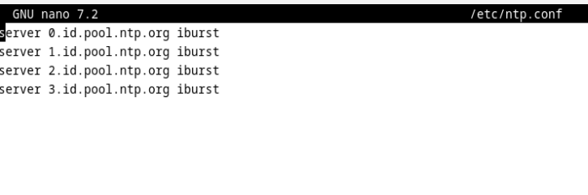
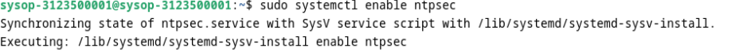
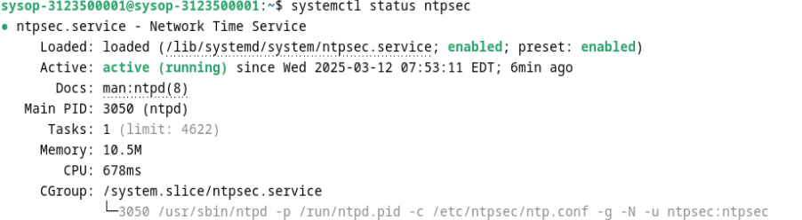
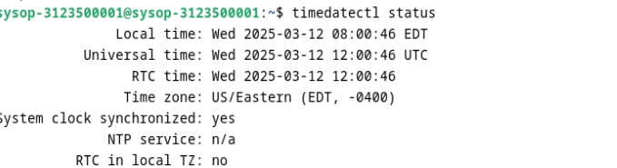
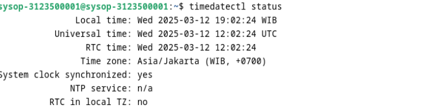

<div align="center">
  <h1 style="text-align: center;font-weight: bold">TUGAS 3<br>Workshop Administrasi Jaringan</h1>
  <h4 style="text-align: center;">Dosen Pengampu : Dr. Ferry Astika Saputra, S.T., M.Sc.</h4>
</div>
<br />
<div align="center">
  
  <h3 style="text-align: center;">Disusun Oleh : <br></h3>
  <p style="text-align: center;">
    <strong>Muhammad Yafi Rifdah Zayyan
    <p style="text-align: center;">
    <strong>Nrp: 3123500001</strong></p>
  </p>

<h3 style="text-align: center;line-height: 1.5">Politeknik Elektronika Negeri Surabaya<br>Departemen Teknik Informatika Dan Komputer<br>Program Studi Teknik Informatika<br>2023/2024</h3>
  <hr><hr>
</div>

# A. Konfigurasi NTP Client dengan NTPsec di Debian 12

## Pendahuluan

NTP (Network Time Protocol) digunakan untuk menyinkronkan waktu sistem dengan server waktu yang akurat. Debian 12 menggunakan **ntpsec** sebagai pengganti **ntp**. Panduan ini menjelaskan cara menginstal dan mengonfigurasi NTP client dengan **ntpsec** agar waktu sistem tetap sinkron dengan NTP server di Indonesia.

---

## 1. Instalasi NTPsec

Pastikan sistem sudah diperbarui, lalu instal **ntpsec**:

```bash
sudo apt update && sudo apt install ntpsec -y
```


disini karena saya sudah menginstall `ntpsec` jadi langkah ini saya skip

---

## 2. Konfigurasi NTP Client

Edit file konfigurasi **NTPsec**:

```bash
sudo nano /etc/ntpsec/ntp.conf
```


Tambahkan atau ubah baris berikut untuk menggunakan server NTP Indonesia:

```bash
server 0.id.pool.ntp.org iburst
server 1.id.pool.ntp.org iburst
server 2.id.pool.ntp.org iburst
server 3.id.pool.ntp.org iburst
```



Simpan perubahan dengan **CTRL + X → Y → ENTER**.

---

## 3. Mengaktifkan dan Menjalankan Layanan NTPsec

Aktifkan dan jalankan layanan **ntpsec** dengan perintah berikut:

```bash
sudo systemctl enable ntpsec
sudo systemctl start ntpsec
```



Periksa apakah layanan berjalan dengan baik:

```bash
systemctl status ntpsec
```


---

## 4. Verifikasi Sinkronisasi Waktu

Cek status sinkronisasi dengan perintah:

```bash
ntpq -p
```


Atau gunakan:

```bash
timedatectl status
```

Pastikan **NTP synchronized: yes**.

---

## 5. Pengaturan Zona Waktu (Opsional)

Jika zona waktu belum sesuai dengan WIB (Waktu Indonesia Barat), atur dengan perintah berikut:

```bash
sudo timedatectl set-timezone Asia/Jakarta
```


Cek kembali waktu sistem:

```bash
date
```


---

## 6. Sinkronisasi Manual (Opsional)

Jika perlu melakukan sinkronisasi waktu secara manual, gunakan perintah berikut:

```bash
sudo systemctl stop ntpsec
sudo ntpdate 0.id.pool.ntp.org
sudo systemctl start ntpsec
```

---
# B. Instalasi dan Konfigurasi Samba di Debian 12

## 1. Instalasi Samba
Untuk menginstal Samba di Debian 12, jalankan perintah berikut:
```bash
sudo apt update
sudo apt install samba -y
```

## 2. Membuat Public Shared Folder
Public Shared Folder adalah folder yang dapat diakses oleh semua pengguna tanpa memerlukan autentikasi.

### **Langkah-langkah:**
1. Buat folder untuk sharing:
   ```bash
   sudo mkdir -p /home/public
   sudo chmod 777 /home/public
   ```
2. Edit file konfigurasi Samba:
   ```bash
   sudo nano /etc/samba/smb.conf
   ```
3. Tambahkan konfigurasi berikut di bagian paling bawah:
   ```ini
   [Public]
   path = /home/public
   browsable = yes
   writable = yes
   guest ok = yes
   create mask = 0777
   directory mask = 0777
   ```
4. Restart layanan Samba:
   ```bash
   sudo systemctl restart smbd nmbd
   ```

## 3. Membuat Limited Shared Folder
Limited Shared Folder adalah folder yang hanya bisa diakses oleh pengguna tertentu.

### **Langkah-langkah:**
1. Buat folder dan atur izin:
   ```bash
   sudo mkdir -p /home/private
   sudo chmod 770 /home/private
   sudo chown root:sambashare /home/private
   ```
2. Tambahkan user untuk akses Samba:
   ```bash
   sudo useradd -M -s /sbin/nologin sambauser
   sudo smbpasswd -a sambauser
   sudo usermod -aG sambashare sambauser
   ```
3. Edit file konfigurasi Samba:
   ```bash
   sudo nano /etc/samba/smb.conf
   ```
4. Tambahkan konfigurasi berikut:
   ```ini
   [Private]
   path = /home/private
   browsable = yes
   writable = yes
   valid users = sambauser
   create mask = 0770
   directory mask = 0770
   ```
5. Restart layanan Samba:
   ```bash
   sudo systemctl restart smbd nmbd
   ```

## 4. Akses Folder dari Windows
- Untuk mengakses Public Shared Folder dari Windows, tekan `Win + R`, lalu ketik:
  ```
  \\10.0.2.15\Public
  ```
- Untuk mengakses Limited Shared Folder, masukkan username dan password yang telah dibuat sebelumnya.

## 5. Akses Folder dari Linux CLI
- Untuk Public Shared Folder:
  ```bash
  smbclient -N //10.0.2.15/Public
  ```
- Untuk Limited Shared Folder:
  ```bash
  smbclient -U sambauser //10.0.2.15/Private
  ```

## 6. Cek Status Samba
Untuk memastikan Samba berjalan dengan baik, jalankan:
```bash
sudo systemctl status smbd nmbd
```
Jika ada masalah, cek log dengan:
```bash
sudo journalctl -u smbd --no-pager | tail -n 20
```

---
Sekarang Samba sudah terinstal dan dikonfigurasi dengan Public dan Limited Shared Folder! 🚀


