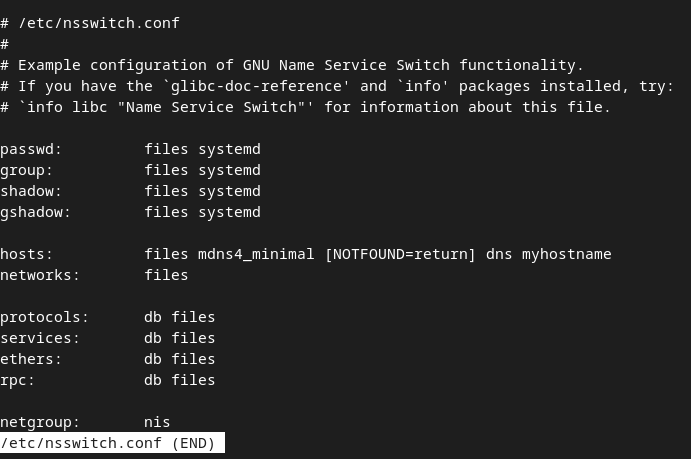
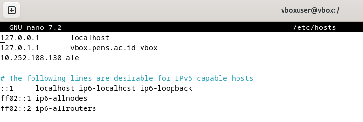
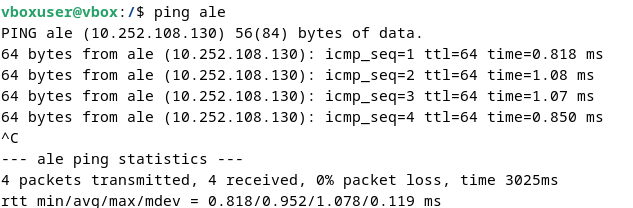

<div align="center">
  <h1 style="text-align: center;font-weight: bold">TUGAS 4<br>Workshop Administrasi Jaringan</h1>
  <h4 style="text-align: center;">Dosen Pengampu : Dr. Ferry Astika Saputra, S.T., M.Sc.</h4>
</div>
<br />
<div align="center">
  
  <h3 style="text-align: center;">Disusun Oleh : <br></h3>
  <p style="text-align: center;">
    <strong>Muhammad Yafi Rifdah Zayyan
    <p style="text-align: center;">
    <strong>Nrp: 3123500001</strong></p>
  </p>

<h3 style="text-align: center;line-height: 1.5">Politeknik Elektronika Negeri Surabaya<br>Departemen Teknik Informatika Dan Komputer<br>Program Studi Teknik Informatika<br>2023/2024</h3>
  <hr><hr>
</div>

# Domain Name System (DNS)

## 📌 Pengertian
**Domain Name System (DNS)** adalah sistem yang digunakan untuk menerjemahkan **nama domain** seperti `google.com` menjadi **alamat IP** yang dapat dimengerti oleh komputer dan perangkat jaringan.
Tanpa DNS, pengguna harus mengingat alamat IP setiap situs web yang ingin mereka kunjungi.

## 🔍 Cara Kerja DNS
1. **User memasukkan domain** di browser (misalnya, `google.com`).
2. **Browser mengecek cache lokal** apakah domain sudah memiliki alamat IP yang tersimpan.
3. **Jika tidak ada cache**, permintaan dikirim ke **DNS Resolver**.
4. **DNS Resolver** mencari informasi melalui hirarki berikut:
   - **Root DNS Server** → Mengarahkan ke **TLD DNS Server**
   - **TLD DNS Server** (contoh: `.com`, `.org`) → Mengarahkan ke **Authoritative Name Server**
   - **Authoritative Name Server** memberikan alamat IP domain tersebut.
5. **Browser menggunakan alamat IP** yang didapat untuk menghubungi server website.

## 📂 Jenis-Jenis DNS Server
- **Recursive Resolver**: Mencari alamat IP dari domain yang diminta pengguna.
- **Root DNS Server**: Server utama yang mengetahui lokasi semua **TLD Server**.
- **TLD DNS Server**: Menyimpan informasi domain berdasarkan ekstensi (.com, .net, dll.).
- **Authoritative Name Server**: Server yang menyimpan informasi DNS final untuk suatu domain.
---


## ⚡ Mengecek DNS di Debian 12

### Perintah 1: `less /etc/nsswitch.conf`


* `less`: Perintah ini digunakan untuk menampilkan isi file satu layar penuh pada satu waktu.
* `/etc/nsswitch.conf`: Ini adalah file konfigurasi penting di sistem Linux yang menentukan urutan sumber yang digunakan untuk mencari informasi nama dan layanan.
* **Hasil**: Perintah ini menampilkan isi dari file `/etc/nsswitch.conf`.

### Perintah 2: `Added user debian`

* Ini menunjukkan bahwa pengguna bernama "debian" telah ditambahkan ke sistem.
* **Catatan**: Tangkapan layar tidak memberikan konteks lebih lanjut tentang bagaimana pengguna ini ditambahkan.

### Penjelasan Tambahan

#### `/etc/nsswitch.conf`

* File ini sangat penting untuk resolusi nama dan layanan di Linux.
* Ini menentukan urutan sumber seperti `/etc/passwd`, DNS, dan LDAP yang akan digunakan untuk mencari informasi seperti nama pengguna, kata sandi, dan alamat IP.
* Contoh baris dalam file ini mungkin terlihat seperti:
    * `passwd: files systemd`
        * Ini berarti sistem akan mencari informasi kata sandi di file `/etc/passwd` terlebih dahulu, lalu di systemd.

#### `Added user debian`

* Pengguna "debian" mungkin ditambahkan menggunakan perintah seperti `adduser` atau `useradd`.
* Ini bisa menjadi bagian dari proses otomatis, seperti instalasi perangkat lunak atau konfigurasi sistem.
* Tanpa informasi lebih lanjut, sulit untuk mengetahui konteks yang tepat dari penambahan pengguna ini.

## Analisis File Konfigurasi `/etc/nsswitch.conf`

Tangkapan layar ini menampilkan isi dari file konfigurasi `/etc/nsswitch.conf` pada sistem Linux.


## Fungsi `/etc/nsswitch.conf`

* File ini adalah konfigurasi **Name Service Switch (NSS)** di Linux.
* NSS mengontrol urutan sumber yang digunakan oleh sistem untuk mencari informasi seperti:
    * Nama pengguna dan grup
    * Kata sandi
    * Nama host dan alamat IP
    * Layanan jaringan
* Tujuannya adalah untuk memberikan fleksibilitas dalam mengonfigurasi bagaimana sistem mencari informasi ini, memungkinkan penggunaan berbagai sumber seperti file lokal, DNS, LDAP, dan lain-lain.

## Isi File

* **Kolom Pertama (Nama Database):** Menentukan jenis informasi yang dicari (misalnya, `passwd`, `hosts`, `services`).
* **Kolom Kedua (Sumber):** Menentukan sumber yang akan digunakan dan urutannya.
    * `files`: Menggunakan file lokal (misalnya, `/etc/passwd`, `/etc/hosts`).
    * `systemd`: Menggunakan layanan systemd (untuk informasi pengguna dan grup).
    * `mdns4_minimal`: Menggunakan Multicast DNS (mDNS) untuk resolusi nama host lokal.
    * `dns`: Menggunakan Domain Name System (DNS) untuk resolusi nama host.
    * `myhostname`: Menggunakan nama host sistem itu sendiri.
    * `db`: Menggunakan database (jarang digunakan dalam konfigurasi modern).
    * `nis`: Menggunakan Network Information Service (NIS).
* **Opsi Tambahan:**
    * `[NOTFOUND=return]`: Menginstruksikan sistem untuk segera mengembalikan "tidak ditemukan" jika sumber `mdns4_minimal` tidak menemukan entri.

## Penjelasan Setiap Baris

* **`passwd: files systemd`**: Informasi kata sandi dicari di file `/etc/passwd` dan layanan systemd.
* **`group: files systemd`**: Informasi grup dicari di file `/etc/group` dan layanan systemd.
* **`shadow: files systemd`**: Informasi shadow password dicari di file `/etc/shadow` dan layanan systemd.
* **`hosts: files mdns4_minimal [NOTFOUND=return] dns myhostname`**: Informasi host dicari di file `/etc/hosts`, mDNS, DNS, dan nama host lokal.
* **`networks: files`**: Informasi jaringan dicari di file lokal.
* **`protocols: db files`**: Informasi protokol dicari di database dan file lokal.
* **`services: db files`**: Informasi layanan dicari di database dan file lokal.
* **`ethers: db files`**: Informasi Ethernet dicari di database dan file lokal.
* **`rpc: db files`**: Informasi RPC dicari di database dan file lokal.
* **`netgroup: nis`**: Informasi netgroup dicari di NIS.

## Penjelasan `/etc/hosts`

* Memetakan nama host ke alamat IP secara lokal.
* Digunakan sebelum DNS untuk resolusi nama host.


Mengkonfigurasi IP dalam file **`/etc/host`** agar komputer mengenali nam Host **Ale**

### 1. Buka kembali **`etc/host`**


### 2. Menambahkan Entri untuk nama Host Ale
```bash
192.168.1.100    ale
```

### 3. Coba melakukan ping dengan nama host adalah Ale


### 4. Sekarang Cek IP


---
x
## 🎯 Kesimpulan
- DNS menghubungkan **domain** ke **alamat IP**
- Bekerja dalam sistem **hierarkis** (Root → TLD → Authoritative)
- Dapat diuji dengan **nslookup, dig, traceroute, dan systemd-resolve**
